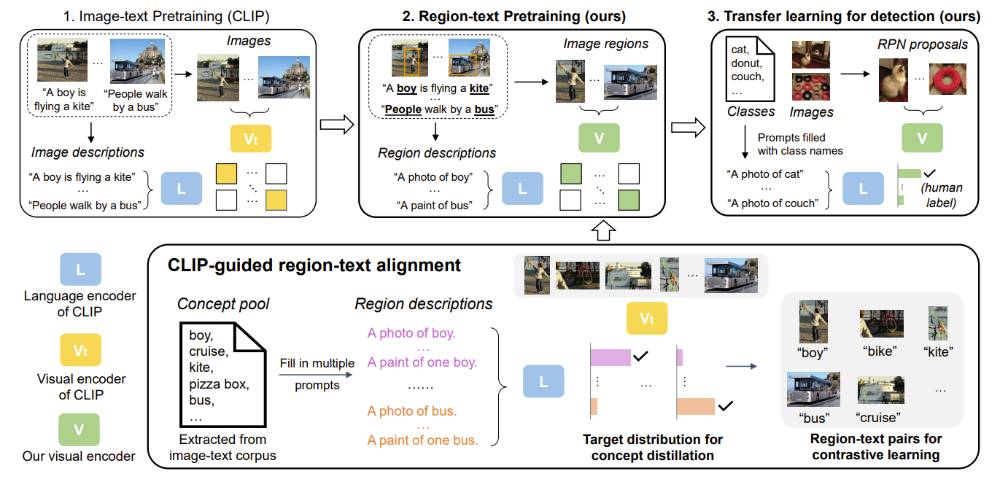

# [RegionCLIP: Region-based Language-Image Pretraining](https://arxiv.org/abs/2112.09106)

This is the official Pytorch implementation of RegionCLIP (CVPR 2022):

["**RegionCLIP: Region-based Language-Image Pretraining**"](https://arxiv.org/abs/2112.09106) by [Yiwu Zhong](https://pages.cs.wisc.edu/~yiwuzhong/), [Jianwei Yang](https://jwyang.github.io/), [Pengchuan Zhang](https://pzzhang.github.io/pzzhang/), [Chunyuan Li](https://chunyuan.li/), [Noel Codella](https://noelcodella.github.io/publicwebsite/), [Liunian Li](https://liunian-harold-li.github.io/), [Luowei Zhou](https://luoweizhou.github.io/), [Xiyang Dai](https://sites.google.com/site/xiyangdai/), [Lu Yuan](https://scholar.google.com/citations?user=k9TsUVsAAAAJ&hl=en), [Yin Li](https://www.biostat.wisc.edu/~yli/), and [Jianfeng Gao](https://www.microsoft.com/en-us/research/people/jfgao/?from=http%3A%2F%2Fresearch.microsoft.com%2Fen-us%2Fum%2Fpeople%2Fjfgao%2F).

## Introduction

Despite the success of CLIP shown in generic and open-vocabulary image recognition capacity, we found it is still hard to recognize the regions in an image due to the image-level contrative learning and coarse image-text alignments used. This work proposed a region-based language-image pretraining (RegionCLIP), which enables a region-level image-concept alignment **without** any region-level human-annotations. We start by disentagling object detection into two components: 1) region proposal and 2) region recognition. With this disentanglement, we exploited the off-the-shelf pretrained CLIP models, and used it as the teacher to discover the alignment between regions extracted by a pretrained RPN and concepts derived from image-associated text corpus. By this way, it significantly enriches the region-concept training data without any requirement of image-text association. As shown below, the resulted model can easily transfer to downstream object detection tasks in both regular setting and open-vocabulary setting.

## Citation

If you find this repo useful to your project, please consider to cite it with following bib:

    @article{zhong2021regionclip,
        title={RegionCLIP: Region-based Language-Image Pretraining},
        author={Zhong, Yiwu and Yang, Jianwei and Zhang, Pengchuan and Li, Chunyuan and Codella, Noel and Li, Liunian Harold and Zhou, Luowei and Dai, Xiyang and Yuan, Lu and Li, Yin and others},
        journal={arXiv preprint arXiv:2112.09106},
        year={2021}
    }

## Contributing

This project welcomes contributions and suggestions.  Most contributions require you to agree to a
Contributor License Agreement (CLA) declaring that you have the right to, and actually do, grant us
the rights to use your contribution. For details, visit https://cla.opensource.microsoft.com.

When you submit a pull request, a CLA bot will automatically determine whether you need to provide
a CLA and decorate the PR appropriately (e.g., status check, comment). Simply follow the instructions
provided by the bot. You will only need to do this once across all repos using our CLA.

This project has adopted the [Microsoft Open Source Code of Conduct](https://opensource.microsoft.com/codeofconduct/).
For more information see the [Code of Conduct FAQ](https://opensource.microsoft.com/codeofconduct/faq/) or
contact [opencode@microsoft.com](mailto:opencode@microsoft.com) with any additional questions or comments.

## Trademarks

This project may contain trademarks or logos for projects, products, or services. Authorized use of Microsoft 
trademarks or logos is subject to and must follow 
[Microsoft's Trademark & Brand Guidelines](https://www.microsoft.com/en-us/legal/intellectualproperty/trademarks/usage/general).
Use of Microsoft trademarks or logos in modified versions of this project must not cause confusion or imply Microsoft sponsorship.
Any use of third-party trademarks or logos are subject to those third-party's policies.
