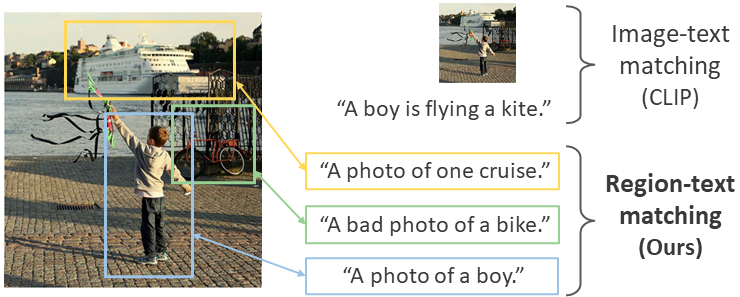
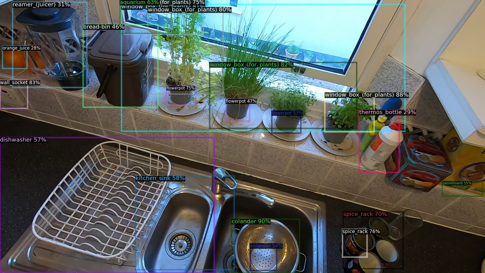

# RegionCLIP: Region-based Language-Image Pretraining

This is the official PyTorch implementation of RegionCLIP (CVPR 2022).

[**Paper**](https://arxiv.org/abs/2112.09106) | [**Demo on Hugging Face**](https://huggingface.co/spaces/CVPR/regionclip-demo) | [**Slides**](https://drive.google.com/file/d/1EepNVJGo_d73Glr4vNjR4Av0dNkBCGcj/view?usp=sharing)

> **RegionCLIP: Region-based Language-Image Pretraining (CVPR 2022)** <br>
> [Yiwu Zhong](https://pages.cs.wisc.edu/~yiwuzhong/), [Jianwei Yang](https://jwyang.github.io/), [Pengchuan Zhang](https://pzzhang.github.io/pzzhang/), [Chunyuan Li](https://chunyuan.li/), [Noel Codella](https://noelcodella.github.io/publicwebsite/), [Liunian Li](https://liunian-harold-li.github.io/), [Luowei Zhou](https://luoweizhou.github.io/), [Xiyang Dai](https://sites.google.com/site/xiyangdai/), [Lu Yuan](https://scholar.google.com/citations?user=k9TsUVsAAAAJ&hl=en), [Yin Li](https://www.biostat.wisc.edu/~yli/), and [Jianfeng Gao](https://www.microsoft.com/en-us/research/people/jfgao/?from=http%3A%2F%2Fresearch.microsoft.com%2Fen-us%2Fum%2Fpeople%2Fjfgao%2F) <br>

<p align="center">

</p>

## Overview

We propose RegionCLIP that significantly extends CLIP to learn region-level visual representations. RegionCLIP enables fine-grained alignment between image regions and textual concepts, and thus supports region-based reasoning tasks including zero-shot object detection and open-vocabulary object detection.

- **Pretraining**: We leverage a CLIP model to match image regions with template captions, and then pretrain our model to align these region-text pairs.
- **Zero-shot inference**: Once pretrained, the learned region representations support zero-shot inference for object detection.
- **Transfer learning**: The learned RegionCLIP model can be further fine-tuned with additional object detection annotations, allowing our model to be used for fully supervised or open-vocabulary object detection.
- **Results**: Our method demonstrates **state-of-the-art** results for zero-shot object detection and open-vocabulary object detection.

## Updates
* [07/11/2022] We included the scripts for concept feature extraction. It can be used for your own costomized concept pool!
* [07/07/2022] We included the scripts for region feature extraction. The extracted visual features can be used for various downstream tasks!
* [06/24/2022] We released [**a Web demo using Gradio on Hugging Face**](https://huggingface.co/spaces/CVPR/regionclip-demo). It uses our pretrained RegionCLIP for zero-shot inference. Check it out!
* [06/20/2022] We released models and inference code for our RegionCLIP!

## Outline

1. [Installation](#Installation)
2. [Datasets](#Datasets)
3. [Model Zoo](#Model-Zoo)
4. [Zero-shot Inference](#Zero-shot-Inference)
5. [Transfer Learning](#Transfer-Learning)
6. [Extract Region Features](#Extract-Region-Features)
7. [Extract Concept Features](#Extract-Concept-Features)
8. [Citation and Acknowledgement](#Citation-and-Acknowledgement)
9. [Contributing](#Contributing)

## Installation

Check [`INSTALL.md`](docs/INSTALL.md) for installation instructions.

## Datasets

Check [`datasets/README.md`](datasets/README.md) for dataset preparation.

## Model Zoo

Check [`MODEL_ZOO.md`](docs/MODEL_ZOO.md) for our pretrained models.


## Zero-shot Inference

After pretraining, RegionCLIP can directly support the challenging zero-shot object detection task **without finetuning on detection annotation**. Given an input image, our pretrained RegionCLIP can match image region features to object concept embeddings, and thus recognize image regions into many object categories. The image regions are produced by a region localizer (e.g., RPN), where the object class names come from a dictionary **specifiied by users**.


### Visualization on custom images

We provide an example below for zero-shot object detection with pretrained RegionCLIP on custom images and for visualizing the results.

<details>

<summary>
Before detecting objects, please prepare pretrained models, label files, and the custom images. See details below.
</summary>
  
- Check [`MODEL_ZOO.md`](docs/MODEL_ZOO.md) to 
  - download the pretrained model checkpoint `regionclip_pretrained-cc_rn50x4.pth` (RegionCLIP with ResNet50x4) to the folder `./pretrained_ckpt/regionclip`.
  - download the class embeddings `lvis_1203_cls_emb_rn50x4.pth` to the folder `./pretrained_ckpt/concept_emb`.
- Check [`datasets/README.md`](datasets/README.md) to download LVIS label file `lvis_v1_val.json` and put it in the folder `./datasets/lvis/lvis_v1_val.json`. The file is used to specify object class names.
- Put all custom images in the folder `./datasets/custom_images/`.

</details>
  
<details>

<summary>
After preparation, run the following script to detect objects.
</summary>
  
```
python3 ./tools/train_net.py \
--eval-only \
--num-gpus 1 \
--config-file ./configs/LVISv1-InstanceSegmentation/CLIP_fast_rcnn_R_50_C4_custom_img.yaml \
MODEL.WEIGHTS ./pretrained_ckpt/regionclip/regionclip_pretrained-cc_rn50x4.pth \
MODEL.CLIP.TEXT_EMB_PATH ./pretrained_ckpt/concept_emb/lvis_1203_cls_emb_rn50x4.pth \
MODEL.CLIP.OFFLINE_RPN_CONFIG ./configs/LVISv1-InstanceSegmentation/mask_rcnn_R_50_FPN_1x.yaml \
MODEL.CLIP.TEXT_EMB_DIM 640 \
MODEL.RESNETS.DEPTH 200 \
MODEL.ROI_BOX_HEAD.POOLER_RESOLUTION 18 \
```

</details>

<details>

<summary>
The detection results will be stored as the file "./output/inference/lvis_instances_results.json". To visualize it, run the script below.
</summary>
 
```
 python ./tools/visualize_json_results.py \
--input ./output/inference/lvis_instances_results.json \
--output ./output/regions \
--dataset lvis_v1_val_custom_img \
--conf-threshold 0.05 \
--show-unique-boxes \
--max-boxes 25 \
--small-region-px 8100\ 
```
</details> 

The visualized images will be placed at `./output/regions/`. The visualized images would look like:

<p align="center">

</p>

In this example, the detection results come from our pretrained RegionCLIP with ResNet50x4 architecture. The regions are proposed by an RPN trained by 866 object categories from LVIS dataset. For now, we use 1203 object class names from LVIS dataset for this visualization example. We also include an example in `visualize_zeroshot_inference.sh` with our pretrained RegionCLIP (ResNet50 architecture).


### Evaluation for zero-shot inference

We provide an example below for evaluating our pretrained RegionCLIP (ResNet50) using ground-truth boxes on COCO dataset. This will reproduce our results in Table 4 of the paper.

<details>

<summary>
Before evaluation, please prepare pretrained models and set up the dataset.
</summary>
  
- Check [`MODEL_ZOO.md`](docs/MODEL_ZOO.md) to 
  - download the pretrained RegionCLIP checkpoint `regionclip_pretrained-cc_rn50.pth` to the folder `./pretrained_ckpt/regionclip`.
  - download the class embeddings `coco_65_cls_emb.pth` to the folder `./pretrained_ckpt/concept_emb`.
- Check [`datasets/README.md`](datasets/README.md) to set up COCO dataset.

</details>
  
<details>

<summary>
After preparation, run the following script to evaluate the pretrained model in zero-shot inference setting.
</summary>
  
```
python3 ./tools/train_net.py \
--eval-only  \
--num-gpus 1 \
--config-file ./configs/COCO-InstanceSegmentation/CLIP_fast_rcnn_R_50_C4_ovd_zsinf.yaml \
MODEL.WEIGHTS ./pretrained_ckpt/regionclip/regionclip_pretrained-cc_rn50.pth \
MODEL.CLIP.TEXT_EMB_PATH ./pretrained_ckpt/concept_emb/coco_65_cls_emb.pth \
MODEL.CLIP.CROP_REGION_TYPE GT \
MODEL.CLIP.MULTIPLY_RPN_SCORE False \
```

</details>

For more examples, please refer to `test_zeroshot_inference.sh`. This script covers a wide combination of pretrained models (ResNet50, ResNet50x4), datasets (COCO, LVIS) and region proposal types (ground-truth regions, RPN proposals). Also, please refer to [MODEL_ZOO.md](docs/MODEL_ZOO.md) for available trained models and [`datasets/README.md`](datasets/README.md) for setting up COCO and LVIS datasets.

## Transfer Learning

Our pretrained RegionCLIP can be further **fine-tuned** when human annotations of objects are available. In this transfer learning setting, we demonstrate results on **open-vocabulary object detection**, where the object detector is trained on base categories and evaluated on both base and **novel** categories.

We show an example for running a trained detector on custom images. Further, we provide scripts of training and evaluation for the benchmark of **open-vocabulary object detection**, including COCO and LVIS datasets (Table 1 & 2 in paper).


### Visualization on custom images

We provide an example below for running a trained open-vocabulary object detector on custom images and for visualizing the results. In this example, the detector is initialized using RegionCLIP (RN50x4), trained on 866 LVIS base categories, and is tasked to detect all 1203 categories on LVIS.

<details>

<summary>
Before detecting objects, please prepare the trained detectors, label files, and the custom images.
</summary>
  
- Check [`MODEL_ZOO.md`](docs/MODEL_ZOO.md) to 
  - download the trained detector checkpoint `regionclip_finetuned-lvis_rn50x4.pth` to the folder `./pretrained_ckpt/regionclip`.
  - download the trained RPN checkpoint `rpn_lvis_866_lsj.pth` to the folder `./pretrained_ckpt/rpn`.
  - download the class embeddings `lvis_1203_cls_emb_rn50x4.pth` to the folder `./pretrained_ckpt/concept_emb`.
- Check [`datasets/README.md`](datasets/README.md) to download label file `lvis_v1_val.json` and put it in the folder `./datasets/lvis/lvis_v1_val.json`.
- Put all custom images in the folder `./datasets/custom_images/`.

</details>
  
<details>

<summary>
After preparation, run the following script to detect objects and visualize the results.
</summary>

```
# for simplicity, we integrate the script in visualize_transfer_learning.sh
bash visualize_transfer_learning.sh
```

</details>

  
The visualized images will be placed at `./output/regions/`.


### Evaluate the trained detectors

We provide an example below for evaluating our open-vocabulary object detector, initialized by RegionCLIP (ResNet50) and trained on COCO dataset.

<details>

<summary>
Before evaluation, please prepare the trained detector and set up the dataset.
</summary>
  
- Check [`MODEL_ZOO.md`](docs/MODEL_ZOO.md) to 
  - download the trained detector checkpoint `regionclip_finetuned-coco_rn50.pth` to the folder `./pretrained_ckpt/regionclip`, 
  - download the trained RPN checkpoint `rpn_coco_48.pth` to the folder `./pretrained_ckpt/rpn`,
  - download the class embeddings `coco_48_base_cls_emb.pth` and `coco_65_cls_emb.pth` to the folder `./pretrained_ckpt/concept_emb`.
- Check [`datasets/README.md`](datasets/README.md) to set up COCO dataset.

</details>
  
<details>

<summary>
After preparation, run the following script to evaluate the trained open-vocabulary detector.
</summary>
  
```
python3 ./tools/train_net.py \
--eval-only  \
--num-gpus 1 \
--config-file ./configs/COCO-InstanceSegmentation/CLIP_fast_rcnn_R_50_C4_ovd.yaml \
MODEL.WEIGHTS ./pretrained_ckpt/regionclip/regionclip_finetuned-coco_rn50.pth \
MODEL.CLIP.OFFLINE_RPN_CONFIG ./configs/COCO-InstanceSegmentation/mask_rcnn_R_50_C4_1x_ovd_FSD.yaml \
MODEL.CLIP.BB_RPN_WEIGHTS ./pretrained_ckpt/rpn/rpn_coco_48.pth \
MODEL.CLIP.TEXT_EMB_PATH ./pretrained_ckpt/concept_emb/coco_48_base_cls_emb.pth \
MODEL.CLIP.OPENSET_TEST_TEXT_EMB_PATH ./pretrained_ckpt/concept_emb/coco_65_cls_emb.pth \
MODEL.ROI_HEADS.SOFT_NMS_ENABLED True \
```

</details>


For more examples, please refer to `test_transfer_learning.sh`. This script includes benchmark evaluation for various combination of trained detectors (ResNet50, ResNet50x4) and datasets (COCO, LVIS). Also, please refer to [MODEL_ZOO.md](docs/MODEL_ZOO.md) for available trained models and [`datasets/README.md`](datasets/README.md) for setting up COCO and LVIS datasets.


### Train detectors on your own

We provide an example below for training an open-vocabulary object detector on COCO dataset, with pretrained RegionCLIP (ResNet50) as the initialization.

<details>

<summary>
Before training, please prepare our pretrained RegionCLIP model and set up the dataset.
</summary>
  
- Check [`MODEL_ZOO.md`](docs/MODEL_ZOO.md) to 
  - download the pretrained RegionCLIP checkpoint `regionclip_pretrained-cc_rn50.pth` to the folder `./pretrained_ckpt/regionclip`, 
  - download the trained RPN checkpoint `rpn_coco_48.pth` to the folder `./pretrained_ckpt/rpn`,
  - download the class embeddings `coco_48_base_cls_emb.pth` and `coco_65_cls_emb.pth` to the folder `./pretrained_ckpt/concept_emb`.
- Check [`datasets/README.md`](datasets/README.md) to set up COCO dataset.

</details>
  
<details>

<summary>
After preparation, run the following script to train an open-vocabulary detector.
</summary>
  
```
python3 ./tools/train_net.py \
--num-gpus 1 \
--config-file ./configs/COCO-InstanceSegmentation/CLIP_fast_rcnn_R_50_C4_ovd.yaml \
MODEL.WEIGHTS ./pretrained_ckpt/regionclip/regionclip_pretrained-cc_rn50.pth \
MODEL.CLIP.OFFLINE_RPN_CONFIG ./configs/COCO-InstanceSegmentation/mask_rcnn_R_50_C4_1x_ovd_FSD.yaml \
MODEL.CLIP.BB_RPN_WEIGHTS ./pretrained_ckpt/rpn/rpn_coco_48.pth \
MODEL.CLIP.TEXT_EMB_PATH ./pretrained_ckpt/concept_emb/coco_48_base_cls_emb.pth \
MODEL.CLIP.OPENSET_TEST_TEXT_EMB_PATH ./pretrained_ckpt/concept_emb/coco_65_cls_emb.pth \
```

</details>

For more examples, please refer to `train_transfer_learning.sh`. This script provides training scripts for various combination of detector backbones (ResNet50, ResNet50x4) and datasets (COCO, LVIS). Also, please refer to [MODEL_ZOO.md](docs/MODEL_ZOO.md) for available trained models and [`datasets/README.md`](datasets/README.md) for setting up COCO and LVIS datasets.


## Extract Region Features

We provide scripts for extracting region features from our pre-trained RegionCLIP. Given a folder of images, our scripts extract region features (along with other detection results such as box coordinates) and save them as local files.

The following is an example using pretrained RegionCLIP with ResNet50. We extend the scripts from zero-shot inference (section above) with minor changes, such as the input and output folders.

<details>

<summary>
The following is a brief introduction for the settings.
</summary>

We enable feature extraction for two types of regions:

- RPN regions: This setting is class-agnostic. The regions are the top-scored RPN proposals.

- Detection regions: This setting requires additional input as a concept embedding file (the concepts of interests). The regions are the final detection output boxes (after 2nd-stage NMS). As a reference, the [Bottom-Up features](https://openaccess.thecvf.com/content_cvpr_2018/papers/Anderson_Bottom-Up_and_Top-Down_CVPR_2018_paper.pdf) (widely-used in vision-language tasks) also come from the final detection boxes.

</details>


<details>

<summary>
Before running scripts, please prepare pretrained models and your custom images.
</summary>
  
- Check [`MODEL_ZOO.md`](docs/MODEL_ZOO.md) to 
  - download the pretrained RegionCLIP checkpoint `regionclip_pretrained-cc_rn50.pth` to the folder `./pretrained_ckpt/regionclip`.
  - download the trained RPN checkpoint `rpn_lvis_866.pth` to the folder `./pretrained_ckpt/rpn`.
  - (optional) if you want to extract features of the boxes detected for 1203 LVIS concepts, download the class embeddings `lvis_1203_cls_emb.pth` to the folder `./pretrained_ckpt/concept_emb`.
- Put all custom images in a folder. It can be specified in the script (check `INPUT_DIR` below).


</details>


<details>

<summary>
After preparation, run the following script to extract region features.
</summary>

The following script extracts features from **RPN regions**.
```
# RN50, features of RPN regions
python3 ./tools/extract_region_features.py \
--config-file ./configs/LVISv1-InstanceSegmentation/CLIP_fast_rcnn_R_50_C4_zsinf.yaml \
MODEL.WEIGHTS ./pretrained_ckpt/regionclip/regionclip_pretrained-cc_rn50.pth \
MODEL.CLIP.CROP_REGION_TYPE RPN \
MODEL.CLIP.MULTIPLY_RPN_SCORE True \
MODEL.CLIP.OFFLINE_RPN_CONFIG ./configs/LVISv1-InstanceSegmentation/mask_rcnn_R_50_FPN_1x.yaml \
MODEL.CLIP.BB_RPN_WEIGHTS ./pretrained_ckpt/rpn/rpn_lvis_866.pth \
INPUT_DIR ./datasets/custom_images \
OUTPUT_DIR ./output/region_feats \
MODEL.CLIP.OFFLINE_RPN_POST_NMS_TOPK_TEST 100 \
```

The following script extracts features from **detection regions** (after 2nd-stage NMS).

```
# You can simply run "bash extract_region_features.sh"
python3 ./tools/extract_region_features.py \
--config-file ./configs/LVISv1-InstanceSegmentation/CLIP_fast_rcnn_R_50_C4_zsinf.yaml \
MODEL.WEIGHTS ./pretrained_ckpt/regionclip/regionclip_pretrained-cc_rn50.pth \
MODEL.CLIP.TEXT_EMB_PATH ./pretrained_ckpt/concept_emb/lvis_1203_cls_emb.pth \
MODEL.CLIP.CROP_REGION_TYPE RPN \
MODEL.CLIP.MULTIPLY_RPN_SCORE True \
MODEL.CLIP.OFFLINE_RPN_CONFIG ./configs/LVISv1-InstanceSegmentation/mask_rcnn_R_50_FPN_1x.yaml \
MODEL.CLIP.BB_RPN_WEIGHTS ./pretrained_ckpt/rpn/rpn_lvis_866.pth \
INPUT_DIR ./datasets/custom_images \
OUTPUT_DIR ./output/region_feats \
TEST.DETECTIONS_PER_IMAGE 100 \
```

The region features of each image will be saved into a `.pth` file in the folder `OUTPUT_DIR`. For simplicity, the current script only supports single GPU inference. As a reference, it takes roughly 0.76 seconds on single Titan-Xp GPU with RegionCLIP-ResNet50 and 1203 LVIS object concepts.

The following is a list of key arguments for feature extraction. You can specify them in the script as needed.

- `INPUT_DIR` and `OUTPUT_DIR`: specify a folder of input images and an output folder where region features will be saved, respectively.

- `MODEL.CLIP.BB_RPN_WEIGHTS`: specifies which trained RPN to use. You can replace it as needed. For more details, please check [`MODEL_ZOO.md`](docs/MODEL_ZOO.md).

- `MODEL.CLIP.TEXT_EMB_PATH` (optional): specifies which object concept embedding file to use. The selection of concepts will affect the per-class NMS (2nd stage) and thus final output boxes.

- `TEST.DETECTIONS_PER_IMAGE`: defines the number of final output regions (e.g., default value is 100 in COCO configs and 300 in LVIS configs) 

- `MODEL.CLIP.OFFLINE_RPN_POST_NMS_TOPK_TEST`: defines the number of region proposals from RPN (e.g., default is 1000). Lowering this value can significantly reduce inference time and memory cost, but might affect the final detection quality.

- `MODEL.CLIP.OFFLINE_RPN_NMS_THRESH` and `MODEL.ROI_HEADS.NMS_THRESH_TEST`: control the NMS IoU thresholds in RPN (1st stage, default is 0.9) and prediction head (2nd stage, default is 0.5), respectively. If you extract features using RPN regions, you might want to change `MODEL.CLIP.OFFLINE_RPN_NMS_THRESH` as needed.

</details>

## Extract Concept Features

Along with the region feature extraction, we also provide scripts for extracting concept features from our pre-trained RegionCLIP. Given a list of concepts, our scripts extract textual embeddings and save them as local files. The following is an example using pretrained RegionCLIP. We extend the scripts from region feature extraction (section above) with minor changes.


<details>

<summary>
Before running scripts, please prepare pretrained models and your custom concepts.
</summary>
  
- Check [`MODEL_ZOO.md`](docs/MODEL_ZOO.md) to 
  - download the pretrained RegionCLIP checkpoint `regionclip_pretrained-cc_rn50.pth` to the folder `./pretrained_ckpt/regionclip`.
- Put all concepts in the file `concepts.txt` with each line as a concept name. Place this file in a folder which can be specified in the script (check `INPUT_DIR` below).


</details>


<details>

<summary>
After preparation, run the following script to extract region features.
</summary>

The following script extracts features from ResNet50.
```
# RN50 concept embeddings
python3 ./tools/extract_concept_features.py \
--config-file ./configs/LVISv1-InstanceSegmentation/CLIP_fast_rcnn_R_50_C4_zsinf.yaml \
MODEL.WEIGHTS ./pretrained_ckpt/regionclip/regionclip_pretrained-cc_rn50.pth \
MODEL.CLIP.OFFLINE_RPN_CONFIG ./configs/LVISv1-InstanceSegmentation/mask_rcnn_R_50_FPN_1x.yaml \
INPUT_DIR ./datasets/custom_concepts \
OUTPUT_DIR ./output/concept_feats \
MODEL.CLIP.GET_CONCEPT_EMB True \
```

And for ResNet50x4, use the following command:
```
# RN50x4 concept embeddings
python3 ./tools/extract_concept_features.py \
--config-file ./configs/LVISv1-InstanceSegmentation/CLIP_fast_rcnn_R_50_C4_zsinf.yaml \
MODEL.WEIGHTS ./pretrained_ckpt/regionclip/regionclip_pretrained-cc_rn50x4.pth \
MODEL.CLIP.TEXT_EMB_DIM 640 \
MODEL.RESNETS.DEPTH 200 \
MODEL.CLIP.OFFLINE_RPN_CONFIG ./configs/LVISv1-InstanceSegmentation/mask_rcnn_R_50_FPN_1x.yaml \
INPUT_DIR ./datasets/custom_concepts \
OUTPUT_DIR ./output/concept_feats \
MODEL.CLIP.GET_CONCEPT_EMB True \
```

The language embeddings of all concepts will be saved into a `.pth` file in the folder `OUTPUT_DIR`. These language embeddings have not been normalized yet, for the consistency with concept embeddings provided in [`MODEL_ZOO.md`](docs/MODEL_ZOO.md).

The following is a list of key arguments for feature extraction. You can specify them in the script as needed.

- `INPUT_DIR` and `OUTPUT_DIR`: specify a folder of input concepts and an output folder where region features will be saved, respectively.

</details>

## Citation and Acknowledgement

### Citation

If you find this repo useful, please consider citing our paper:

```
@inproceedings{zhong2022regionclip,
  title={Regionclip: Region-based language-image pretraining},
  author={Zhong, Yiwu and Yang, Jianwei and Zhang, Pengchuan and Li, Chunyuan and Codella, Noel and Li, Liunian Harold and Zhou, Luowei and Dai, Xiyang and Yuan, Lu and Li, Yin and others},
  booktitle={Proceedings of the IEEE/CVF Conference on Computer Vision and Pattern Recognition},
  pages={16793--16803},
  year={2022}
}
```

### Acknowledgement

This repository was built on top of [Detectron2](https://github.com/facebookresearch/detectron2), [CLIP](https://github.com/openai/CLIP), [OVR-CNN](https://github.com/alirezazareian/ovr-cnn), and [maskrcnn-benchmark](https://github.com/facebookresearch/maskrcnn-benchmark). We thank the effort from our community.

## Contributing

This project welcomes contributions and suggestions.  Most contributions require you to agree to a
Contributor License Agreement (CLA) declaring that you have the right to, and actually do, grant us
the rights to use your contribution. For details, visit https://cla.opensource.microsoft.com.

When you submit a pull request, a CLA bot will automatically determine whether you need to provide
a CLA and decorate the PR appropriately (e.g., status check, comment). Simply follow the instructions
provided by the bot. You will only need to do this once across all repos using our CLA.

This project has adopted the [Microsoft Open Source Code of Conduct](https://opensource.microsoft.com/codeofconduct/).
For more information see the [Code of Conduct FAQ](https://opensource.microsoft.com/codeofconduct/faq/) or
contact [opencode@microsoft.com](mailto:opencode@microsoft.com) with any additional questions or comments.
